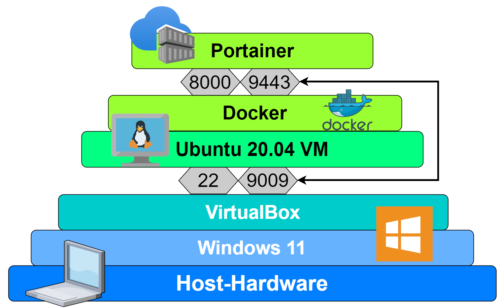

## Portainer auf Linux
*von Silas Forrer*

# Was ist Portainer?
    Portainer ist eine schlanke Verwaltungsoberfläche, mit der Sie Ihre verschiedenen Docker-Umgebungen einfach verwalten können.

    Portainer bietet eine leichte und einfache Lösung für die Verwaltung von Docker-Containern und Swarm-Diensten über eine Weboberfläche. \
    Portainer unterstützt eine breite Palette von Funktionen für die Verwaltung von Docker-Containern, wie z. B. die Verwaltung oder der Erstellung \
    und Löschung von Swarm-Diensten, Benutzerauthentifizierung, Berechtigungen, Verbindungsaufbau, Ausführung von Befehlen in der Konsole von \
    laufenden Containern und die Anzeige von Container-Logs.

Aus dem englischen Übersetzt, Quelle: [Containers: Portainer Overview](https://betterprogramming.pub/portainer-review-382575dabb76)


# Inhaltsverzeichnis

- **[Darstellung](#Darstellung)**
- **[Umgebung](#Umgebung)**
  - [Verwendete Software](#verwendete-software)
  - [VM-Spezifikationen](#vm-spezifikationen)
- **[Sourcecode](#Sourcecode)**
  - [vagrantfile](#vagrantfile)
  - [Basis Konfiguration](#basis-konfiguration)
  - [Konfigurationen durch die Shell](#konfigurationen-durch-die-shell)
    - [Initial Tasks](#initial-tasks)
    - [Firewall](#firewall)
    - [Portainer Docker-Container](#portainer-docker-container)
    - [Abschluss](#abschluss)
- **[Fazit](#Fazit)**
- **[Testing](#Testing)**
- **[Quellen](#Quellen)**

# Darstellung



# Umgebung
## Verwendete Software:

| **Produkt** | **Version** |
----------|----------
| Vagrant | 2.2.19 |
| VirtualBox | 6.1 |
| Portainer | 2.9.3 |
| Ubuntu | 20.04 |
  
## VM-Spezifikationen:

| **Attribut** | **Wert** |
-------|---------------
| IPv4 | 192.169.4.20 |
| CPU-Cores | 5 |
| Memory | 5GB |
| USB | off |
| USBehci | off |

# Sourcecode

## Vagrantfile

```ruby
Vagrant.configure("2") do |config|
  config.vm.box = "ubuntu/focal64"
config.vm.hostname = "apache"
config.vm.network "private_network", ip: "192.169.4.20"
config.vm.provider "virtualbox" do |vb|
  vb.name = "Apache in Docker"
  vb.customize ["modifyvm", :id, "--cpus", "5"]
  vb.customize ["modifyvm", :id, "--memory", "5000"]
  vb.customize ["modifyvm", :id, "--usb", "off"]
  vb.customize ["modifyvm", :id, "--usbehci", "off"]
end
config.vm.provision "shell", inline: <<-SHELL
  sudo su - &&
  apt-get update -y &&
  apt-get upgrade -y && 
  apt-get autoremove -y &&
  apt-get install docker docker-compose -y &&

  systemctl enable docker &&
  systemctl start docker &&
  
  apt-get install ufw -y &&
  apt-get install openssh-server -y &&
  ufw enable &&
  ufw allow 9009 &&
  ufw allow 22 &&
  
  docker volume create portainer_volume &&
  docker run -d -p 8008:8000 -p 9009:9443 --name portainer_container \
  --restart=always \
  -v /var/run/docker.sock:/var/run/docker.sock \
  -v portainer_volume:/data \
  portainer/portainer-ce:2.9.3 &&

  apt-get autoremove -y &&
  apt-get autoclean -y
SHELL
end
```

## Basis Konfiguration

Zu Begin wird im Vagrantfile die grundsätzlichen Informationen, \
wie zum Beispiel Netzwerkkonfigurationen (IP), Hardware (Memory, CPU etc.), das Gastbetriebssystem etc.

```ruby
Vagrant.configure("2") do |config|
  config.vm.box = "ubuntu/focal64"
  config.vm.hostname = "apache"
  config.vm.network "private_network", ip: "192.169.4.20"
  config.vm.provider "virtualbox" do |vb|
    vb.name = "Apache in Docker"
    vb.customize ["modifyvm", :id, "--cpus", "5"]
    vb.customize ["modifyvm", :id, "--memory", "5000"]
    vb.customize ["modifyvm", :id, "--usb", "off"]
    vb.customize ["modifyvm", :id, "--usbehci", "off"]
  end
```

## Konfigurationen durch die Shell
> Um Shell/Bash-Commands zu nutzen muss zuerst ein Bereich folgendermassen definiert werden:
> ```ruby
> config.vm.provision "shell", inline: <<-SHELL
> ```
> \
> **(?)** Die Bezeichnung `&&` am Ende jeder Zeile macht, 
> dass die nächste zeile nur dann ausgeführt wird wenn der command auf der aktuellen Zeile ohne Error beendet wurde.

### Initial Tasks
Als erstes wechsle ich den Nutzer zu "root", damit ich keine Probleme mit Berechtigungen bekomme 
und nicht immer "sudo" schreiben muss. \
Als zweites aktualisiere und bereinige ich das System, jeweils mit einem "-y" um Benutzerinteraktionen zu umgehen. \
Sobald alles aktuell ist wird [docker](https://www.docker.com/) und [docker-compose](https://docs.docker.com/compose/) \ installiert.

```bash
sudo su - &&
apt-get update -y &&
apt-get upgrade -y && 
apt-get autoremove -y &&
apt-get install docker docker-compose -y &&
```

Sobald die Dockerprodukte installiert sind wird eingestellt, \
dass das diese bei jedem Systemstart automatisch auch starten.

```bash
systemctl enable docker &&
systemctl start docker &&
```
